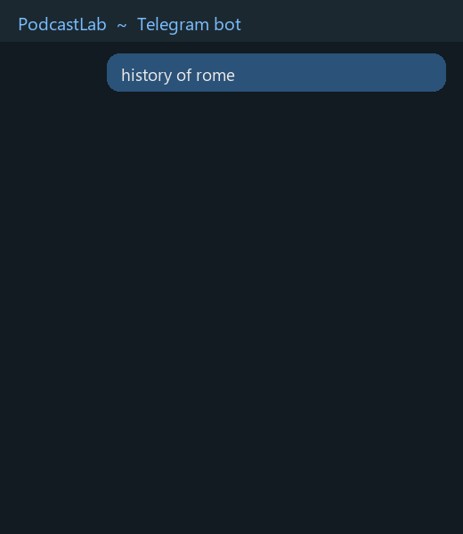
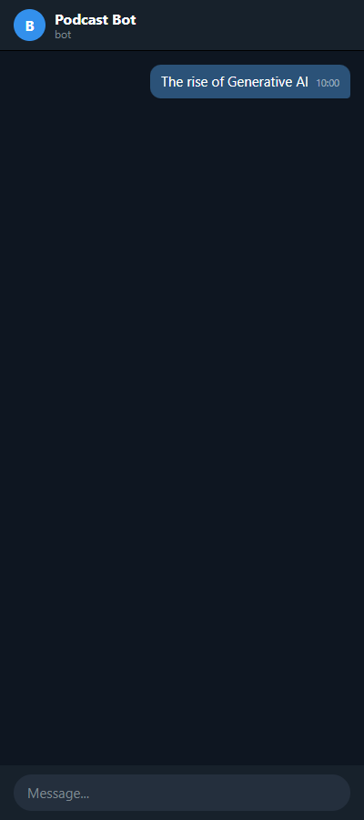

# Claude · NotebookLM · Long · Music · Telegram

[](https://colab.research.google.com/github/03gilbe-design/claude-notebooklm-long-music-telegram/blob/main/PodcastLab_Colab.ipynb)
[](https://www.python.org/)
[](LICENSE)
[](https://github.com/03gilbe-design/claude-notebooklm-long-music-telegram/pulls)

**Turn any topic into long multi-part NotebookLM podcasts — with music — and build a searchable dataset of prompts + transcripts + speaker diarization + sources. Comes with a [Claude Code skill](https://github.com/03gilbe-design/notebooklm-podcast-skill).**

Not another "NotebookLM alternative". This *uses* the real NotebookLM: it automates it end to end, and captures everything it produces into a reusable dataset that doesn't exist anywhere else.

> Built with [Claude Code](https://claude.com/claude-code) — and ships as a Claude Code skill (`skill/SKILL.md`).



**The pipeline, visually** — NotebookLM forges the episodes, music drops in, Claude mixes, Telegram delivers:


**The Telegram bot in action** (menu-driven):



---

## Why this exists

The NotebookLM app makes one podcast at a time and throws away the prompt. This pipeline:

- **Generates podcasts in parts** from a single topic (deep-research → N episodes), each with a custom prompt
- **Adds music** — intro / stinger between parts / background under the hosts — chosen from your own tracks (pure `ffmpeg`, no re-transcription)
- **Builds a dataset**: for every podcast it pairs the **real prompt** + **word-level transcript** + **who-said-what (2-speaker diarization)** + **source links & extracted markdown**. This prompt→transcript dataset is not available online — you build your own.
- **Batch everything**: download all your Audio Overviews, transcribe them all, recover all prompts — each step resumes where it left off.
- Optional **Telegram bot** to drive it from your phone with inline buttons.

Nobody combines NotebookLM → podcast → music + diarized dataset. Verified across the whole GitHub NotebookLM landscape.

## What's in the box

| File | What it does |
|---|---|
| `PodcastLab_Colab.ipynb` | The full pipeline on Colab GPU: **download → transcribe (faster-whisper) → diarize (pyannote, 2 speakers) → dataset** |
| `bot.py` | Telegram bot: topic → deep-research → N-part podcast with music, delivered in chat |
| `download_audios.py` / `recover_prompts.py` | Batch download audios / recover real prompts from NotebookLM |
| `pipeline.py` | One command to chain download + prompt recovery |
| `postprod.py` | Insert jingles at spoken markers (`STACCO MUSICALE`) using word timestamps |
| `test_*.py`, `run_colab_local.py` | Real test harnesses: run bot handlers with fake users, execute the Colab notebook locally |

## How the dataset looks

```json
{
  "title": "How data travels the network",
  "prompt": "Impersonate each step... no intro/outro... topics: socket programming...",
  "transcript": "[SPEAKER_00] Welcome... [SPEAKER_01] Exactly, so...",
  "n_speaker": 2,
  "source_links": ["RFC 791", "Beej's Guide to Network Programming"]
}
```

## Quick start

**On Colab (does everything):**
1. Upload `storage_state.json` (your NotebookLM auth from the desktop CLI) to Drive `PodcastLab/`
2. Runtime → T4 GPU → run cells 1 → 2 (download) → 3 (transcribe+diarize) → 4 (dataset)

**Telegram bot (optional, on your PC):**
```bash
notebooklm login                 # one-time browser login
pip install python-telegram-bot  # + ffmpeg in PATH
# put TELEGRAM_TOKEN in .env (copy from .env.example)
python bot.py
```

## Also available for free (same NotebookLM API)

The underlying `notebooklm-py` exposes 9 output types — this repo can be extended to generate, from the same topic, not just **podcasts** but **video, quiz, mind-map, flashcards, slides, infographic, report**.

## Requirements

- Python 3.10+, `ffmpeg`
- A Google account with NotebookLM access
- Colab (free T4) for transcription/diarization
- HuggingFace token (free) + accept `pyannote/speaker-diarization-3.1` terms for speaker labels

## Notes

- Uses the **unofficial** NotebookLM API (via [`notebooklm-py`](https://github.com/teng-lin/notebooklm-py)). Google can change it anytime. For **personal / educational use** — respect NotebookLM's Terms of Service.
- Auth (`storage_state.json`) expires ~24h; refresh with `notebooklm login` on the desktop.
- Language: pipeline defaults to Italian podcasts (`language='it'`), trivially changed.

## License

MIT
